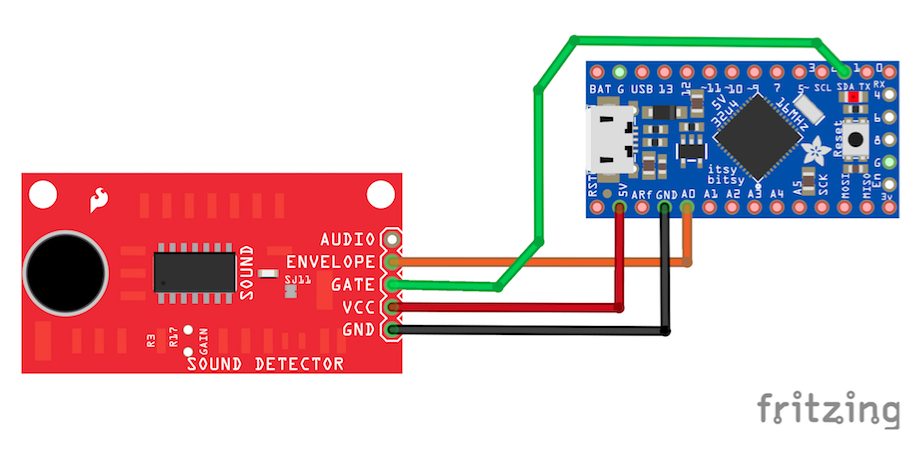

# AF3 Gunshot detector workshop - instructions

## Useful links

### Microcontroller board

https://learn.adafruit.com/introducting-itsy-bitsy-32u4?view=all

### Microphone & Sound detector

https://learn.sparkfun.com/tutorials/sound-detector-hookup-guide

### Real-time clock

https://www.velleman.eu/downloads/29/vma301_a4v01.pdf

https://github.com/msparks/arduino-ds1302

## Instructions

### Installing the Arduino IDE - Blinking lights

In order to get the microcontroller board talking to your computer over USB, you will need to install some software.

 1. Download and install the Arduino software by following the instructions from [this link](http://www.arduino.cc/en/Main/Software)

 2. Under Preferences > Additional Boards Manager URLs copy-paste the address `https://adafruit.github.io/arduino-board-index/package_adafruit_index.json`

 3. Under Tools > Board > Boards manager, select Type > Contributed and install the `Adafruit AVR Boards`

 4. Under Tools > Board, you should now be able to select the board `Adafruit ItsyBitsy 32u4 5V 16 MHz`

 5. After connecting your board via USB, a new port will appear under Tools > Port. Select this port.

 6. Load the `blink` example (File > Examples > 01.Basics > Blink), and press 'Upload'. If successful, the builtin LED on your board should repeatedly blink on for one second and off for one second.

The code for the `blink` example is well documented. Try reading it and figuring out what it does. Can you change the blinking period, e.g. to 0.5 seconds ON - 2 seconds OFF?

### Serial communication - The Propaganda Machine

 7. Load the file `hello_world.ino`. Upload it to your board.

 8. Open the serial monitor (Tools > Serial Monitor) and select 9600 as the baud rate.

 9. Check the serial messages coming from the board.

 10. Consider and discuss whether ants are, in fact, important.

 11. Change the message being output by the board to reflect your conclusions from step 10. Some suggestions:
    * "Ants are colossally, massively important"
    * "I can not comment on the importance of ants at this time"

 12. Try changing the code so that it outputs different ant-related messages in sequence, every 2 seconds.

### Connecting the microphone

 13. Connect the sound detector board as shown in the following image:

 14. Open the file `gunshot_serial_example_1.ino` and upload it to your board.

 15. Open the serial monitor and make some noise. How useful is the output?

 16. Open the serial plotter and make some noise. How useful is the output?

 17. Try changing the value of the `delay` parameter. How does it affect the output?

### Adding a 'trigger' criterion

 18. Open the file `gunshot_serial_example_1a.ino` and upload it to your board.

 19. Open the serial plotter and try making some noise. When an 'event' is detected, the red line should go down to -50.

 20. Try changing the value of the `threshold` and `delay` parameters. What happens in the output?

### Adding a moving average

 21. Open the file `gunshot_serial_example_2.ino` and upload it to your board.

 22. Open the serial plotter and try making some noise. What is the meaning of each line?

 23. Finally, try tweaking all the parameters to best detect sharp noises, such as clapping. Pair off with another team, without looking at their parameters (`numDelay`, `threshold`, `eventDuration`, `numreadings`). Try detecting the same noise from the same distance. Whoever detects the further noise without false positives is the winner.
